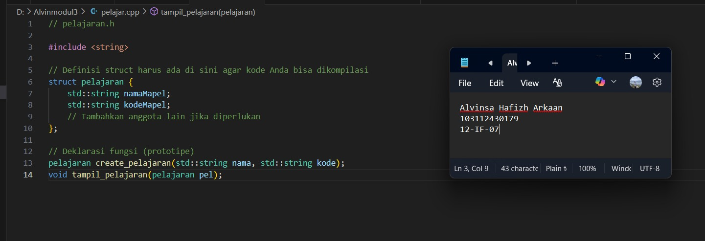
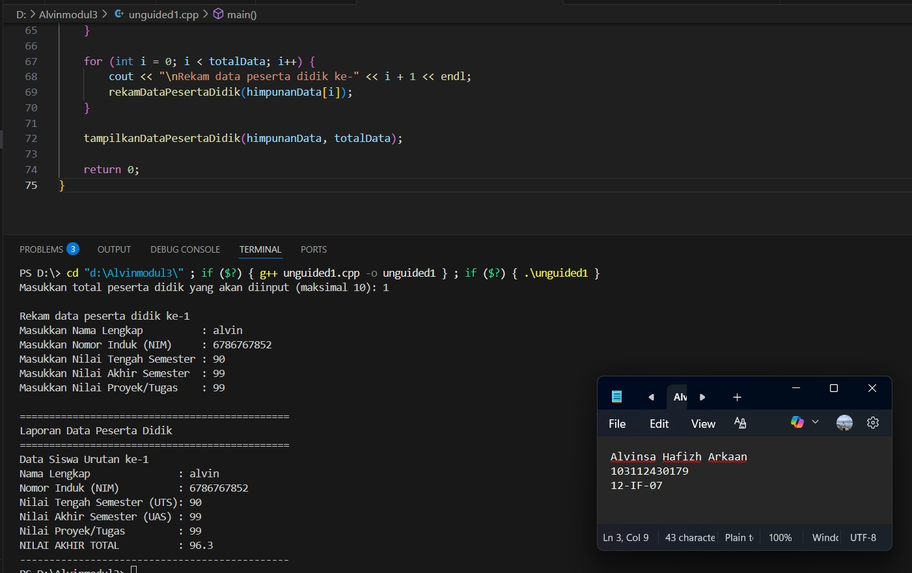
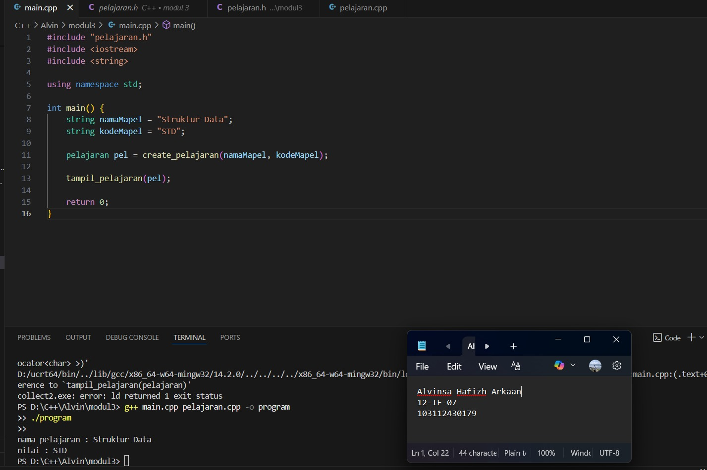
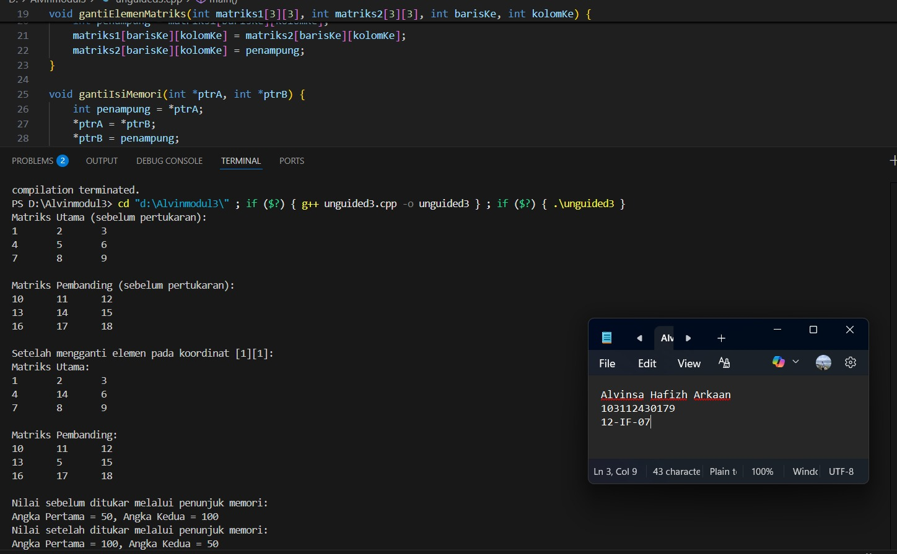

# <h1 align="center">Laporan Praktikum Modul 3 <br> Abstract Data Type </h1>
<p align="center">Alvinsa Hafizh Arkaan - 103112430179</p>

## Dasar Teori

Abstract Data Type (ADT) adalah model matematis atau spesifikasi konseptual dari tipe data yang hanya mendefinisikan perilaku dan operasi yang dapat dilakukan pada data tersebut (apa yang dilakukan), tanpa menentukan detail implementasi internalnya (bagaimana data disimpan). ADT berfungsi sebagai alat abstraksi dan enkapsulasi, di mana pengguna hanya berinteraksi dengan antarmuka operasi (seperti push dan pop untuk ADT Stack) dan dilindungi dari kompleksitas struktur data mendasar (seperti Array atau Linked List), sehingga meningkatkan modularitas, fleksibilitas, dan pemeliharaan kode.

## Guided

### guided 1
   ```c++
// pelajaran.h

#include <string>

// Definisi struct harus ada di sini agar kode Anda bisa dikompilasi
struct pelajaran {
    std::string namaMapel;
    std::string kodeMapel;
    // Tambahkan anggota lain jika diperlukan
};

// Deklarasi fungsi (prototipe)
pelajaran create_pelajaran(std::string nama, std::string kode);
void tampil_pelajaran(pelajaran pel);
```

Program C++ di atas mendefinisikan dan mendeklarasikan komponen dasar untuk mengelola data tentang suatu mata pelajaran. struct pelajaran	Ini adalah struktur data (atau struct) yang menjadi model untuk sebuah entitas "mata pelajaran". Ia memiliki dua anggota utama: namaMapel (untuk menyimpan nama mata pelajaran, seperti "Matematika") dan kodeMapel (untuk menyimpan kode unik mata pelajaran, seperti "MTK101"), keduanya bertipe std::string, pelajaran create_pelajaran(std::string nama, std::string kode);	Ini adalah prototipe fungsi yang berfungsi sebagai konstruktor atau factory untuk tipe data pelajaran. Fungsi ini akan menerima dua string (nama dan kode) sebagai masukan, kemudian membuat dan mengembalikan sebuah objek pelajaran baru yang telah terinisialisasi dengan nilai-nilai tersebut, void tampil_pelajaran(pelajaran pel);	Ini adalah prototipe fungsi yang berfungsi untuk menampilkan (mencetak) detail dari sebuah objek pelajaran. Fungsi ini menerima satu objek pelajaran sebagai masukan (parameter) dan tidak mengembalikan nilai (void), melainkan melakukan aksi (mencetak) ke output standar (konsol).

> output
> 


## Unguided

### Soal 1

```c++
#include <iostream>
#include <string>
using namespace std;

struct PesertaDidik {
    string namaLengkap;    // Nama Mahasiswa
    string nomorInduk;     // NIM (Nomor Induk Mahasiswa)
    float nilaiTengah;     // Nilai UTS (Ujian Tengah Semester)
    float nilaiAkhirSemester;// Nilai UAS (Ujian Akhir Semester)
    float nilaiProyek;     // Nilai Tugas
    float nilaiTotal;      // Nilai Akhir
};

float hitungNilaiTotal(float nilaiTengah, float nilaiAkhirSemester, float nilaiProyek) {
    // Bobot: Tengah Semester 30%, Akhir Semester 40%, Proyek 30%
    return (0.3 * nilaiTengah) + (0.4 * nilaiAkhirSemester) + (0.3 * nilaiProyek);
}

void rekamDataPesertaDidik(PesertaDidik &siswa) {
    cout << "Masukkan Nama Lengkap          : ";
    getline(cin, siswa.namaLengkap);
    cout << "Masukkan Nomor Induk (NIM)     : ";
    getline(cin, siswa.nomorInduk);
    cout << "Masukkan Nilai Tengah Semester : ";
    cin >> siswa.nilaiTengah;
    cout << "Masukkan Nilai Akhir Semester  : ";
    cin >> siswa.nilaiAkhirSemester;
    cout << "Masukkan Nilai Proyek/Tugas    : ";
    cin >> siswa.nilaiProyek;
    cin.ignore(); // Membersihkan buffer input
    siswa.nilaiTotal = hitungNilaiTotal(siswa.nilaiTengah, siswa.nilaiAkhirSemester, siswa.nilaiProyek);
}

void tampilkanDataPesertaDidik(PesertaDidik daftarSiswa[], int total) {
    cout << "\n==============================================\n";
    cout << "Laporan Data Peserta Didik\n";
    cout << "==============================================\n";
    for (int i = 0; i < total; i++) {
        cout << "Data Siswa Urutan ke-" << i + 1 << endl;
        cout << "Nama Lengkap               : " << daftarSiswa[i].namaLengkap << endl;
        cout << "Nomor Induk (NIM)          : " << daftarSiswa[i].nomorInduk << endl;
        cout << "Nilai Tengah Semester (UTS): " << daftarSiswa[i].nilaiTengah << endl;
        cout << "Nilai Akhir Semester (UAS) : " << daftarSiswa[i].nilaiAkhirSemester << endl;
        cout << "Nilai Proyek/Tugas         : " << daftarSiswa[i].nilaiProyek << endl;
        cout << "NILAI AKHIR TOTAL          : " << daftarSiswa[i].nilaiTotal << endl;
        cout << "----------------------------------------------\n";
    }
}

int main() {
    PesertaDidik himpunanData[10];
    int totalData;

    cout << "Masukkan total peserta didik yang akan diinput (maksimal 10): ";
    cin >> totalData;
    cin.ignore();

    if (totalData > 10) {
        cout << "Total melebihi batasan maksimum (10) data!" << endl;
        return 0;
    }

    for (int i = 0; i < totalData; i++) {
        cout << "\nRekam data peserta didik ke-" << i + 1 << endl;
        rekamDataPesertaDidik(himpunanData[i]);
    }

    tampilkanDataPesertaDidik(himpunanData, totalData);

    return 0;
}
```
>

Program C++ ini adalah sistem sederhana untuk mengelola dan menghitung nilai akhir bagi sejumlah Peserta Didik (Mahasiswa) menggunakan struktur data (struct) dan fungsi modular. struct PesertaDidik Struktur ini mendefinisikan blueprint untuk satu entitas peserta didik, menggabungkan data pribadi dan data nilai dalam satu unit. Anggotanya meliputi Data Diri: namaLengkap dan nomorInduk (NIM), keduanya bertipe string, Data Nilai Input: nilaiTengah (UTS), nilaiAkhirSemester (UAS), dan nilaiProyek (Tugas), semuanya bertipe float, Data Nilai Hasil: nilaiTotal, bertipe float, yang akan menyimpan hasil perhitungan nilai akhir. Lalu fungsi ini menghitung nilai akhir (nilaiTotal) seorang peserta didik berdasarkan tiga komponen nilai input dengan bobot sebagai berikut Nilai Tengah Semester (UTS): 30% (0.3), Nilai Akhir Semester (UAS): 40% (0.4), Nilai Proyek/Tugas: 30% (0.3). Kemudian void rekamDataPesertaDidik(PesertaDidik &siswa) Fungsi ini bertanggung jawab untuk berinteraksi dengan pengguna dan mengisi data ke dalam satu objek PesertaDidik. Fungsi menggunakan passing by reference (&siswa) sehingga perubahan yang dilakukan pada siswa (input dari user) akan langsung memodifikasi objek asli di fungsi main. Fungsi ini membaca nama dan NIM menggunakan getline() (untuk mengakomodasi spasi) dan nilai-nilai numerik menggunakan cin >>, Setelah semua nilai input dimasukkan, fungsi ini secara otomatis memanggil hitungNilaiTotal untuk menentukan dan menyimpan nilai akhir (siswa.nilaiTotal), Penggunaan cin.ignore() diperlukan untuk membersihkan buffer input setelah pembacaan nilai numerik, mencegah masalah dengan pemanggilan getline() berikutnya.


> 


### Soal 2

soal nomor 2

```c++
#include "pelajaran.h"
#include <iostream>
#include <string>

using namespace std;

int main() {
    string namaMapel = "Struktur Data";
    string kodeMapel = "STD";
    
    pelajaran pel = create_pelajaran(namaMapel, kodeMapel);
    
    tampil_pelajaran(pel);

    return 0;
}


#include "pelajaran.h"
#include <iostream>
#include <string>

pelajaran create_pelajaran(std::string nama, std::string kode) {
    pelajaran pelBaru;
    pelBaru.namaMapel = nama;
    pelBaru.kodeMapel = kode;
    return pelBaru;
}

void tampil_pelajaran(pelajaran pel) {
    std::cout << "nama pelajaran : " << pel.namaMapel << std::endl;
    std::cout << "nilai : " << pel.kodeMapel << std::endl; 
}


#ifndef PELAJARAN_H_INCLUDED
#define PELAJARAN_H_INCLUDED

#include <string>

struct pelajaran {
    std::string namaMapel; 
    std::string kodeMapel; 
};

pelajaran create_pelajaran(std::string nama, std::string kode);

void tampil_pelajaran(pelajaran pel);

#endif
```

Program ini adalah contoh pemrograman modular C++ yang mengimplementasikan sebuah modul untuk mengelola data pelajaran. Program dibagi menjadi tiga bagian: Header File (pelajaran.h) yang mendefinisikan struktur data pelajaran (terdiri dari namaMapel dan kodeMapel) serta mendeklarasikan fungsi-fungsi terkait; File Implementasi (pelajaran.cpp) yang berisi definisi fungsional dari create_pelajaran untuk membuat objek baru dan tampil_pelajaran untuk mencetak detail objek ke konsol; dan File Utama (main.cpp) yang bertindak sebagai driver, menginisialisasi nama dan kode pelajaran ("Struktur Data", "STD"), memanggil create_pelajaran untuk membuat objek, dan kemudian memanggil tampil_pelajaran untuk menampilkan hasilnya. Secara keseluruhan, program ini menunjukkan bagaimana memisahkan antarmuka (deklarasi) dari implementasi (definisi) untuk menciptakan kode yang lebih terorganisir.

> Output
> 

### Soal 3

soal nomor 3

```c++
#include <iostream>
using namespace std;

void sajikanMatriks(int matriks[3][3]) {
    for (int baris = 0; baris < 3; baris++) {
        for (int kolom = 0; kolom < 3; kolom++) {
            cout << matriks[baris][kolom] << "\t";
        }
        cout << endl;
    }
}

void gantiNilaiLokal(int &angka1, int &angka2) {
    int penampung = angka1;
    angka1 = angka2;
    angka2 = penampung;
}

void gantiElemenMatriks(int matriks1[3][3], int matriks2[3][3], int barisKe, int kolomKe) {
    int penampung = matriks1[barisKe][kolomKe];
    matriks1[barisKe][kolomKe] = matriks2[barisKe][kolomKe];
    matriks2[barisKe][kolomKe] = penampung;
}

void gantiIsiMemori(int *ptrA, int *ptrB) {
    int penampung = *ptrA;
    *ptrA = *ptrB;
    *ptrB = penampung;
}

int main() {
    int MatriksUtama[3][3] = {
        {1, 2, 3},
        {4, 5, 6},
        {7, 8, 9}
    };

    int MatriksPembanding[3][3] = {
        {10, 11, 12},
        {13, 14, 15},
        {16, 17, 18}
    };

    cout << "Matriks Utama (sebelum pertukaran):\n";
    sajikanMatriks(MatriksUtama);
    cout << "\nMatriks Pembanding (sebelum pertukaran):\n";
    sajikanMatriks(MatriksPembanding);

    gantiElemenMatriks(MatriksUtama, MatriksPembanding, 1, 1);

    cout << "\nSetelah mengganti elemen pada koordinat [1][1]:\n";
    cout << "Matriks Utama:\n";
    sajikanMatriks(MatriksUtama);
    cout << "\nMatriks Pembanding:\n";
    sajikanMatriks(MatriksPembanding);

    int angkaPertama = 50, angkaKedua = 100;
    int *penunjuk1 = &angkaPertama;
    int *penunjuk2 = &angkaKedua;

    cout << "\nNilai sebelum ditukar melalui penunjuk memori:\n";
    cout << "Angka Pertama = " << angkaPertama << ", Angka Kedua = " << angkaKedua << endl;

    gantiIsiMemori(penunjuk1, penunjuk2);

    cout << "Nilai setelah ditukar melalui penunjuk memori:\n";
    cout << "Angka Pertama = " << angkaPertama << ", Angka Kedua = " << angkaKedua << endl;

    return 0;
}
```
>

Jadi Program C++ ini adalah demonstrasi mengenai mekanisme pemanggilan fungsi (passing mechanisms) dan operasi pertukaran nilai (swapping) pada berbagai tipe data: matriks dan variabel tunggal, menggunakan baik passing by reference maupun passing by pointer. void sajikanMatriks(int matriks[3][3]) Fungsi ini bertanggung jawab untuk mencetak (menyajikan) isi dari sebuah matriks 3×3 integer ke konsol. Ia menggunakan dua loop bersarang untuk mengiterasi melalui setiap elemen matriks, mencetaknya, dan menambahkan baris baru (endl) setelah setiap baris selesai dicetak, void gantiNilaiLokal(int &angka1, int &angka2) Fungsi ini melakukan operasi pertukaran (swap) nilai antara dua variabel integer. Kunci di sini adalah penggunaan referensi (&) pada parameter. Ini berarti fungsi bekerja langsung dengan variabel asli di memori (bukan salinannya), sehingga perubahan nilai (pertukaran) akan tercermin di luar fungsi, void gantiElemenMatriks(int matriks1[3][3], int matriks2[3][3], int barisKe, int kolomKe) Fungsi ini menukar nilai elemen pada posisi tertentu (barisKe, kolomKe) antara dua matriks 3×3. Mirip dengan fungsi di atas, karena array (termasuk matriks) di C++ selalu dilewatkan secara by-reference (walaupun tidak menggunakan simbol &), pertukaran elemen akan memengaruhi matriks asli (MatriksUtama dan MatriksPembanding) yang ada di fungsi main.
> Output
> 
# AlvinsaHafizhArkaan_103112430179_modul3.
LAPRAK

