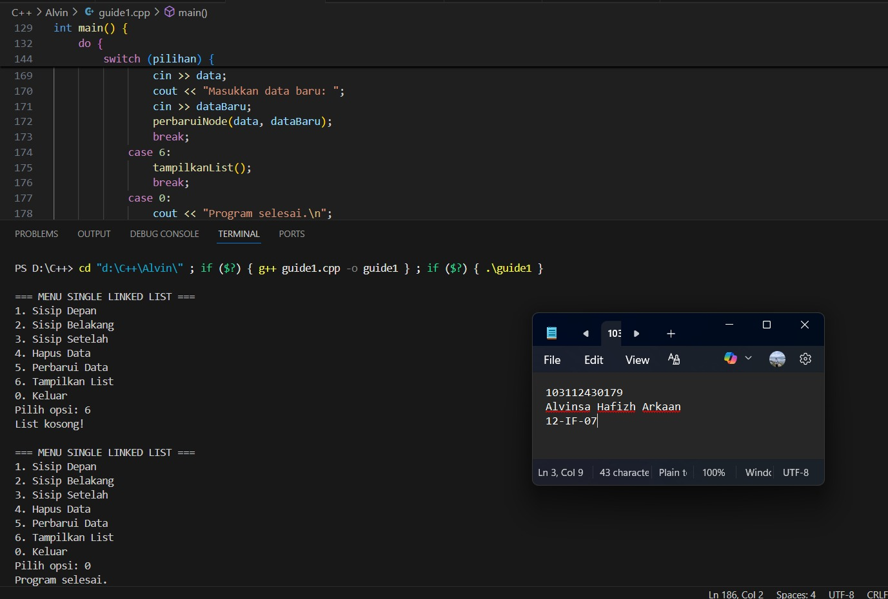
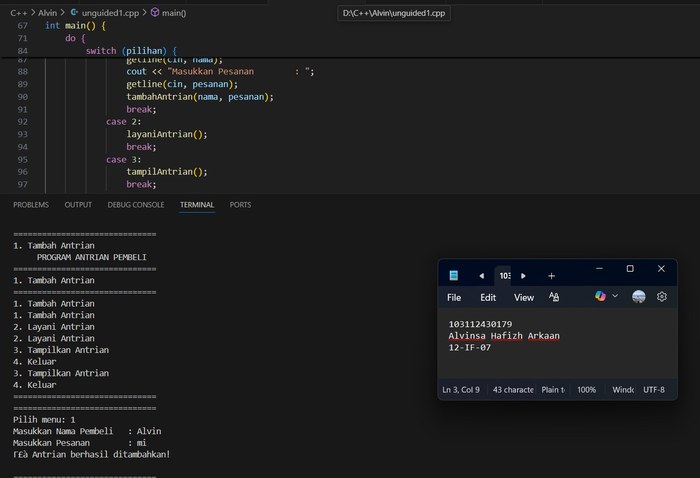
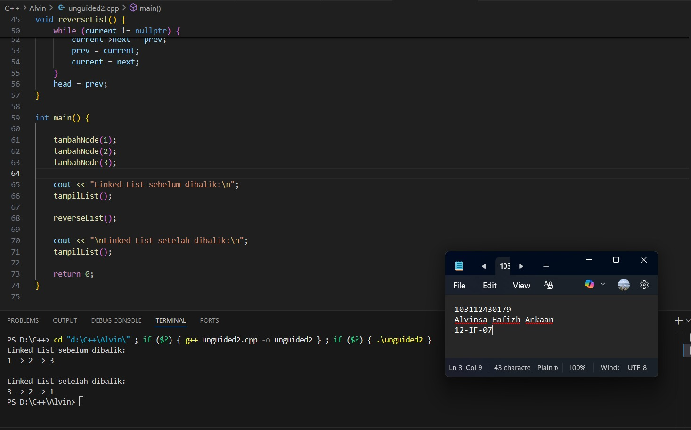

# <h1 align="center">Laporan Praktikum Modul 4 <br> SINGLY LINKED LIST </h1>
<p align="center">Alvinsa Hafizh Arkaan - 103112430179</p>

## Dasar Teori

Singly Linked List adalah struktur data linier dinamis yang terdiri dari serangkaian blok data diskret yang disebut Node, di mana setiap Node memiliki dua bagian: Data yang menyimpan nilai, dan sebuah Pointer (Next) yang menyimpan alamat memori Node berikutnya, menciptakan rantai satu arah. Daftar ini diakses dan dikelola melalui Node pertamanya, yang disebut Head, sementara Node terakhirnya (Tail) memiliki pointer Next yang menunjuk ke NULL, menandakan akhir daftar. 

## Guided

### guided 1
   ```c++
#include <iostream>
using namespace std;

// Struktur Node
struct Node {
    int data;
    Node* next;
};

// Pointer kepala (head)
Node* kepala = nullptr;

// Fungsi untuk membuat node baru
Node* buatNode(int data) {
    Node* nodeBaru = new Node();
    nodeBaru->data = data;
    nodeBaru->next = nullptr;
    return nodeBaru;
}

// Fungsi untuk menyisipkan node di depan
void sisipDepan(int data) {
    Node* nodeBaru = buatNode(data);
    nodeBaru->next = kepala; // Node baru menunjuk ke kepala lama
    kepala = nodeBaru;       // Kepala sekarang menunjuk ke node baru
    cout << "Data " << data << " berhasil disisipkan di depan.\n";
}

// Fungsi untuk menyisipkan node di belakang
void sisipBelakang(int data) {
    Node* nodeBaru = buatNode(data);
    if (kepala == nullptr) {
        kepala = nodeBaru;
    } else {
        Node* temp = kepala;
        while (temp->next != nullptr) {
            temp = temp->next;
        }
        temp->next = nodeBaru;
    }
    cout << "Data " << data << " berhasil disisipkan di belakang.\n";
}

// Fungsi untuk menyisipkan node setelah node tertentu
void sisipSetelah(int target, int dataBaru) {
    Node* temp = kepala;
    while (temp != nullptr && temp->data != target) {
        temp = temp->next;
    }

    if (temp == nullptr) {
        cout << "Data target " << target << " tidak ditemukan!\n";
    } else {
        Node* nodeBaru = buatNode(dataBaru);
        nodeBaru->next = temp->next;
        temp->next = nodeBaru;
        cout << "Data " << dataBaru << " berhasil disisipkan setelah " << target << ".\n";
    }
}

// ========== FUNGSI HAPUS ==========
void hapusNode(int data) {
    if (kepala == nullptr) {
        cout << "List kosong!\n";
        return;
    }

    Node* temp = kepala;
    Node* sebelumnya = nullptr;

    // Kasus 1: Jika data di node pertama (kepala)
    if (temp != nullptr && temp->data == data) {
        kepala = temp->next;
        delete temp;
        cout << "Data " << data << " berhasil dihapus.\n";
        return;
    }

    // Kasus 2: Cari node yang akan dihapus
    while (temp != nullptr && temp->data != data) {
        sebelumnya = temp;
        temp = temp->next;
    }

    // Jika data tidak ditemukan
    if (temp == nullptr) {
        cout << "Data " << data << " tidak ditemukan!\n";
        return;
    }

    // Lepaskan node dari list dan bebaskan memori
    sebelumnya->next = temp->next;
    delete temp;
    cout << "Data " << data << " berhasil dihapus.\n";
}

// ========== FUNGSI PERBARUI ==========
void perbaruiNode(int dataLama, int dataBaru) {
    Node* temp = kepala;
    while (temp != nullptr && temp->data != dataLama) {
        temp = temp->next;
    }

    if (temp == nullptr) {
        cout << "Data " << dataLama << " tidak ditemukan!\n";
    } else {
        temp->data = dataBaru;
        cout << "Data " << dataLama << " berhasil diperbarui menjadi " << dataBaru << ".\n";
    }
}

// ========== FUNGSI TAMPILKAN ==========
void tampilkanList() {
    if (kepala == nullptr) {
        cout << "List kosong!\n";
        return;
    }

    Node* temp = kepala;
    cout << "Isi Linked List: ";
    while (temp != nullptr) {
        cout << temp->data << " -> ";
        temp = temp->next;
    }
    cout << "NULL\n";
}

// ========== PROGRAM UTAMA ==========
int main() {
    int pilihan, data, target, dataBaru;

    do {
        cout << "\n=== MENU SINGLE LINKED LIST ===\n";
        cout << "1. Sisip Depan\n";
        cout << "2. Sisip Belakang\n";
        cout << "3. Sisip Setelah\n";
        cout << "4. Hapus Data\n";
        cout << "5. Perbarui Data\n";
        cout << "6. Tampilkan List\n";
        cout << "0. Keluar\n";
        cout << "Pilih opsi: ";
        cin >> pilihan;

        switch (pilihan) {
            case 1:
                cout << "Masukkan data: ";
                cin >> data;
                sisipDepan(data);
                break;
            case 2:
                cout << "Masukkan data: ";
                cin >> data;
                sisipBelakang(data);
                break;
            case 3:
                cout << "Masukkan data target: ";
                cin >> target;
                cout << "Masukkan data baru: ";
                cin >> dataBaru;
                sisipSetelah(target, dataBaru);
                break;
            case 4:
                cout << "Masukkan data yang ingin dihapus: ";
                cin >> data;
                hapusNode(data);
                break;
            case 5:
                cout << "Masukkan data lama: ";
                cin >> data;
                cout << "Masukkan data baru: ";
                cin >> dataBaru;
                perbaruiNode(data, dataBaru);
                break;
            case 6:
                tampilkanList();
                break;
            case 0:
                cout << "Program selesai.\n";
                break;
            default:
                cout << "Pilihan tidak valid!\n";
        }
    } while (pilihan != 0);

    return 0;
}

```

Jadi program C++ ini mengimplementasikan struktur data Single Linked List yang menyimpan data berupa bilangan bulat (int). Program ini menggunakan pendekatan global pointer (Node* kepala) untuk menunjuk ke node pertama (head) dari list dan menyediakan serangkaian fungsi dasar untuk mengelola list, yang diakses melalui antarmuka menu di fungsi main().

> Output
> 


## Unguided

### Soal 1

```c++
#include <iostream>
#include <string>
using namespace std;

struct Node {
    string nama;
    string pesanan;
    Node *next;
};

Node *front = nullptr;
Node *rear = nullptr;

bool isEmpty() {
    return front == nullptr;
}

void tambahAntrian(string nama, string pesanan) {
    Node *baru = new Node;
    baru->nama = nama;
    baru->pesanan = pesanan;
    baru->next = nullptr;

    if (isEmpty()) {
        front = rear = baru;
    } else {
        rear->next = baru;
        rear = baru;
    }
    cout << "✅ Antrian berhasil ditambahkan!\n";
}

void layaniAntrian() {
    if (isEmpty()) {
        cout << "⚠️  Antrian kosong, tidak ada yang dilayani!\n";
        return;
    }

    Node *hapus = front;
    cout << "👤 Melayani: " << hapus->nama << " - Pesanan: " << hapus->pesanan << endl;
    front = front->next;

    if (front == nullptr) {
        rear = nullptr; 
    }

    delete hapus;
}

void tampilAntrian() {
    if (isEmpty()) {
        cout << "📭 Antrian kosong!\n";
        return;
    }

    cout << "\n📋 Daftar Antrian:\n";
    Node *temp = front;
    int nomor = 1;
    while (temp != nullptr) {
        cout << nomor << ". " << temp->nama << " - " << temp->pesanan << endl;
        temp = temp->next;
        nomor++;
    }
    cout << endl;
}

int main() {
    int pilihan;
    string nama, pesanan;

    do {
        cout << "==============================\n";
        cout << "     PROGRAM ANTRIAN PEMBELI  \n";
        cout << "==============================\n";
        cout << "1. Tambah Antrian\n";
        cout << "2. Layani Antrian\n";
        cout << "3. Tampilkan Antrian\n";
        cout << "4. Keluar\n";
        cout << "==============================\n";
        cout << "Pilih menu: ";
        cin >> pilihan;
        cin.ignore(); 

        switch (pilihan) {
            case 1:
                cout << "Masukkan Nama Pembeli   : ";
                getline(cin, nama);
                cout << "Masukkan Pesanan        : ";
                getline(cin, pesanan);
                tambahAntrian(nama, pesanan);
                break;
            case 2:
                layaniAntrian();
                break;
            case 3:
                tampilAntrian();
                break;
            case 4:
                cout << "👋 Keluar dari program.\n";
                break;
            default:
                cout << "❌ Pilihan tidak valid!\n";
        }

        cout << endl;
    } while (pilihan != 4);

    return 0;
}
```
>

Jadi program C++ ini mengimplementasikan struktur data Queue (Antrian) dengan prinsip FIFO (First In, First Out), di mana pembeli yang pertama masuk akan dilayani (dihapus) pertama kali. Implementasi Queue ini memanfaatkan Single Linked List sebagai dasar, yang menyimpan data pembeli (nama dan pesanan).
> Output
> 


### Soal 2

soal nomor 2

```c++
#include <iostream>
using namespace std;

struct Node {
    int data;
    Node* next;
};

Node* head = nullptr;


void tambahNode(int nilai) {
    Node* baru = new Node;
    baru->data = nilai;
    baru->next = nullptr;

    if (head == nullptr) {
        head = baru;
    } else {
        Node* temp = head;
        while (temp->next != nullptr) {
            temp = temp->next;
        }
        temp->next = baru;
    }
}


void tampilList() {
    if (head == nullptr) {
        cout << "Linked List kosong." << endl;
        return;
    }

    Node* temp = head;
    while (temp != nullptr) {
        cout << temp->data;
        if (temp->next != nullptr) cout << " -> ";
        temp = temp->next;
    }
    cout << endl;
}


void reverseList() {
    Node* prev = nullptr;
    Node* current = head;
    Node* next = nullptr;

    while (current != nullptr) {
        next = current->next;   
        current->next = prev;   
        prev = current;         
        current = next;         
    }
    head = prev; 
}

int main() {

    tambahNode(1);
    tambahNode(2);
    tambahNode(3);

    cout << "Linked List sebelum dibalik:\n";
    tampilList();

    reverseList();

    cout << "\nLinked List setelah dibalik:\n";
    tampilList();

    return 0;
}
```

Program C++ ini mengimplementasikan operasi dasar dan fungsi inti untuk membalikkan (reverse) urutan elemen dalam struktur data Single Linked List yang menyimpan bilangan bulat (int). struct Node: Mendefinisikan elemen list, yang berisi int data dan pointer Node* next yang menghubungkan ke node berikutnya, node* head: Pointer global yang menunjuk ke node pertama (kepala) list, tambahNode(int nilai): Fungsi untuk menambahkan node baru selalu di akhir list. Fungsi ini menelusuri list dari head sampai menemukan node terakhir (di mana temp->next adalah nullptr), lalu menautkan node baru di sana, tampilList(): Fungsi untuk menelusuri list dari awal sampai akhir dan mencetak seluruh elemen list secara berurutan, dipisahkan oleh ->.

> Output
> 

