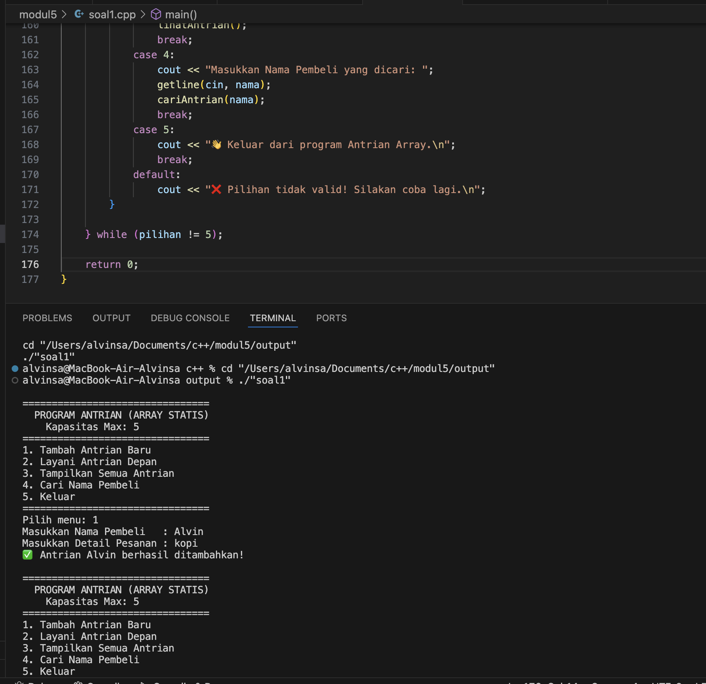

# <h1 align="center">Laporan Praktikum Modul 5 <br> Singly Linked List </h1>
<p align="center">Alvinsa Hafizh Arkaan - 103112430179</p>

## Dasar Teori

Singly Linked List adalah struktur data dinamis yang terdiri dari sekumpulan elemen yang disebut node, di mana setiap node menyimpan dua bagian yaitu data dan pointer (next) yang menunjuk ke node berikutnya. Berbeda dengan array yang menggunakan lokasi memori berurutan, node dalam linked list dapat tersebar di mana saja di memori karena keterhubungannya dibentuk melalui pointer. Struktur ini diawali dengan pointer head yang menunjuk ke node pertama dan diakhiri dengan node terakhir yang menunjuk ke NULL sebagai penanda akhir. Operasi dasar yang dapat dilakukan pada singly linked list meliputi penambahan (insert), penghapusan (delete), pembaruan (update), dan penelusuran data (traversal). Kelebihan struktur ini adalah fleksibilitas dalam menambah atau menghapus elemen tanpa perlu menggeser data lain, namun kelemahannya adalah akses data yang lebih lambat karena setiap elemen harus ditelusuri secara berurutan dari awal. Singly Linked List sering digunakan dalam aplikasi yang memerlukan perubahan ukuran data secara dinamis dan menjadi dasar bagi bentuk linked list lainnya seperti Doubly Linked List dan Circular Linked List.


## Guided

### guided 1
   ```c++
#include <iostream>
using namespace std;

// Struktur Node
struct Node {
    int data;
    Node* next;
};

// Pointer awal
Node* head = nullptr;

// Fungsi untuk membuat node baru
Node* createNode(int data) {
    Node* newNode = new Node();
    newNode->data = data;
    newNode->next = nullptr;
    return newNode;
}

// Fungsi Insert Depan
void insertDepan(int data) {
    Node* newNode = createNode(data);
    newNode->next = head;
    head = newNode;
    cout << "Data " << data << " berhasil ditambahkan di depan.\n";
}

// Fungsi Insert Belakang
void insertBelakang(int data) {
    Node* newNode = createNode(data);
    if (head == nullptr) {
        head = newNode;
    } else {
        Node* temp = head;
        while (temp->next != nullptr) {
            temp = temp->next;
        }
        temp->next = newNode;
    }
    cout << "Data " << data << " berhasil ditambahkan di belakang.\n";
}

// Fungsi Insert Setelah Node Tertentu
void insertSetelah(int target, int dataBaru) {
    Node* temp = head;
    while (temp != nullptr && temp->data != target) {
        temp = temp->next;
    }

    if (temp == nullptr) {
        cout << "Data " << target << " tidak ditemukan!\n";
    } else {
        Node* newNode = createNode(dataBaru);
        newNode->next = temp->next;
        temp->next = newNode;
        cout << "Data " << dataBaru << " berhasil disisipkan setelah " << target << ".\n";
    }
}

// Fungsi Hapus Node
void hapusNode(int data) {
    if (head == nullptr) {
        cout << "List kosong!\n";
        return;
    }

    Node* temp = head;
    Node* prev = nullptr;

    if (temp != nullptr && temp->data == data) {
        head = temp->next;
        delete temp;
        cout << "Data " << data << " berhasil dihapus.\n";
        return;
    }

    while (temp != nullptr && temp->data != data) {
        prev = temp;
        temp = temp->next;
    }

    if (temp == nullptr) {
        cout << "Data " << data << " tidak ditemukan!\n";
        return;
    }

    prev->next = temp->next;
    delete temp;
    cout << "Data " << data << " berhasil dihapus.\n";
}

// Fungsi Update Node
void updateNode(int dataLama, int dataBaru) {
    Node* temp = head;
    while (temp != nullptr && temp->data != dataLama) {
        temp = temp->next;
    }

    if (temp == nullptr) {
        cout << "Data " << dataLama << " tidak ditemukan!\n";
    } else {
        temp->data = dataBaru;
        cout << "Data " << dataLama << " berhasil diupdate menjadi " << dataBaru << ".\n";
    }
}

// Fungsi Tampilkan List
void tampilkanList() {
    if (head == nullptr) {
        cout << "List kosong!\n";
        return;
    }

    Node* temp = head;
    cout << "Isi Linked List: ";
    while (temp != nullptr) {
        cout << temp->data << " -> ";
        temp = temp->next;
    }
    cout << "NULL\n";
}

// MAIN PROGRAM
int main() {
    int pilihan, data, target, dataBaru;

    do {
        cout << "\n=== MENU SINGLE LINKED LIST ===\n";
        cout << "1. Insert Depan\n";
        cout << "2. Insert Belakang\n";
        cout << "3. Insert Setelah\n";
        cout << "4. Hapus Data\n";
        cout << "5. Update Data\n";
        cout << "6. Tampilkan List\n";
        cout << "0. Keluar\n";
        cout << "Pilih: ";
        cin >> pilihan;

        switch (pilihan) {
            case 1:
                cout << "Masukkan data: ";
                cin >> data;
                insertDepan(data);
                break;
            case 2:
                cout << "Masukkan data: ";
                cin >> data;
                insertBelakang(data);
                break;
            case 3:
                cout << "Masukkan data target: ";
                cin >> target;
                cout << "Masukkan data baru: ";
                cin >> dataBaru;
                insertSetelah(target, dataBaru);
                break;
            case 4:
                cout << "Masukkan data yang ingin dihapus: ";
                cin >> data;
                hapusNode(data);
                break;
            case 5:
                cout << "Masukkan data lama: ";
                cin >> data;
                cout << "Masukkan data baru: ";
                cin >> dataBaru;
                updateNode(data, dataBaru);
                break;
            case 6:
                tampilkanList();
                break;
            case 0:
                cout << "Program selesai.\n";
                break;
            default:
                cout << "Pilihan tidak valid!\n";
        }
    } while (pilihan != 0);

    return 0;
}


```

Program di atas merupakan implementasi struktur data Single Linked List menggunakan bahasa C++. Program ini berfungsi untuk mengelola data secara dinamis dengan cara menambah, menghapus, memperbarui, dan menampilkan elemen-elemen dalam list. Setiap elemen atau node terdiri dari dua bagian, yaitu data untuk menyimpan nilai dan next yang menunjuk ke node berikutnya. Program menyediakan berbagai fungsi seperti insertDepan() untuk menambah data di awal list, insertBelakang() untuk menambah data di akhir, insertSetelah() untuk menyisipkan data setelah nilai tertentu, hapusNode() untuk menghapus data tertentu, updateNode() untuk memperbarui nilai data lama menjadi baru, dan tampilkanList() untuk menampilkan seluruh isi list dalam urutan dari awal hingga akhir. Melalui menu interaktif di terminal, pengguna dapat memilih operasi yang diinginkan, memasukkan data sesuai perintah, dan melihat hasil perubahan struktur list secara langsung. Program ini memberikan contoh praktis bagaimana Linked List bekerja dengan konsep pointer dalam pengelolaan memori yang dinamis tanpa menggunakan array berukuran tetap.

> Output
> 


### guided 2


```c++
#include <iostream>
using namespace std;

#define Nil nullptr

// Deklarasi struktur Node
struct Node {
    int info;
    Node* next;

    Node(int value) {
        info = value;
        next = Nil;
    }
};

// Kelas List
class List {
private:
    Node* first;

public:
    // Konstruktor
    List() {
        first = Nil;
    }

    // Mengecek apakah list kosong
    bool isEmpty() {
        return first == Nil;
    }

    // Membuat list kosong
    void createList() {
        first = Nil;
    }

    // Menampilkan isi list
    void printInfo() {
        if (isEmpty()) {
            cout << "List kosong" << endl;
        } else {
            Node* p = first;
            cout << "Isi list: ";
            while (p != Nil) {
                cout << p->info << " ";
                p = p->next;
            }
            cout << endl;
        }
    }

    // Menghitung jumlah elemen
    int nbList() {
        int count = 0;
        Node* p = first;
        while (p != Nil) {
            count++;
            p = p->next;
        }
        return count;
    }

    // Menyisipkan elemen di awal
    void insertFirst(int value) {
        Node* p = new Node(value);
        p->next = first;
        first = p;
    }

    // Menyisipkan elemen di akhir
    void insertLast(int value) {
        Node* p = new Node(value);
        if (isEmpty()) {
            first = p;
        } else {
            Node* last = first;
            while (last->next != Nil) {
                last = last->next;
            }
            last->next = p;
        }
    }

    // Menyisipkan elemen setelah node tertentu
    void insertAfter(Node* prec, int value) {
        if (prec != Nil) {
            Node* p = new Node(value);
            p->next = prec->next;
            prec->next = p;
        }
    }

    // Menghapus elemen pertama
    void delFirst() {
        if (!isEmpty()) {
            Node* temp = first;
            first = first->next;
            delete temp;
        }
    }

    // Menghapus elemen terakhir
    void delLast() {
        if (!isEmpty()) {
            if (first->next == Nil) {
                delete first;
                first = Nil;
            } else {
                Node* prev = Nil;
                Node* curr = first;
                while (curr->next != Nil) {
                    prev = curr;
                    curr = curr->next;
                }
                prev->next = Nil;
                delete curr;
            }
        }
    }

    // Menghapus elemen setelah node tertentu
    void delAfter(Node* prec) {
        if (prec != Nil && prec->next != Nil) {
            Node* temp = prec->next;
            prec->next = temp->next;
            delete temp;
        }
    }

    // Menghapus elemen dengan nilai tertentu
    void delP(int value) {
        if (isEmpty()) return;

        Node* curr = first;
        Node* prev = Nil;

        while (curr != Nil && curr->info != value) {
            prev = curr;
            curr = curr->next;
        }

        if (curr != Nil) { // ditemukan
            if (prev == Nil)
                first = curr->next;
            else
                prev->next = curr->next;
            delete curr;
        }
    }

    // Mencari elemen dengan nilai tertentu
    Node* findElm(int value) {
        Node* p = first;
        while (p != Nil) {
            if (p->info == value)
                return p;
            p = p->next;
        }
        return Nil;
    }

    // Membalik urutan elemen list
    void invertList() {
        Node* prev = Nil;
        Node* curr = first;
        Node* next = Nil;

        while (curr != Nil) {
            next = curr->next;
            curr->next = prev;
            prev = curr;
            curr = next;
        }
        first = prev;
    }

    // Menghapus semua elemen list
    void delAll() {
        Node* p = first;
        while (p != Nil) {
            Node* temp = p;
            p = p->next;
            delete temp;
        }
        first = Nil;
    }

    // Menyalin isi list ke list lain
    void copyList(List &L2) {
        delAll();
        Node* p = first;
        while (p != Nil) {
            L2.insertLast(p->info);
            p = p->next;
        }
    }

    // Destruktor
    ~List() {
        delAll();
    }
};

// Contoh penggunaan dalam main
int main() {
    List L;

    cout << "=== Program Linked List C++ ===" << endl;

    L.insertFirst(10);
    L.insertFirst(5);
    L.insertLast(15);
    L.insertLast(20);

    L.printInfo(); // Output: 5 10 15 20
    cout << "Jumlah elemen: " << L.nbList() << endl;

    cout << "Hapus elemen pertama..." << endl;
    L.delFirst();
    L.printInfo();

    cout << "Hapus elemen terakhir..." << endl;
    L.delLast();
    L.printInfo();

    cout << "Cari elemen bernilai 10..." << endl;
    Node* found = L.findElm(10);
    if (found) cout << "Ditemukan: " << found->info << endl;
    else cout << "Tidak ditemukan" << endl;

    cout << "Balik urutan list..." << endl;
    L.invertList();
    L.printInfo();

    cout << "Hapus semua elemen..." << endl;
    L.delAll();
    L.printInfo();

    return 0;
}
```
Program di atas merupakan implementasi struktur data Single Linked List dalam bahasa C++ dengan pendekatan berorientasi objek (OOP) menggunakan kelas List dan struktur Node. Setiap node memiliki dua elemen, yaitu info untuk menyimpan data bertipe int dan pointer next yang menunjuk ke node berikutnya. Kelas List memiliki berbagai fungsi untuk melakukan operasi dasar linked list, seperti insertFirst() dan insertLast() untuk menambahkan elemen di awal atau akhir list, delFirst() dan delLast() untuk menghapus elemen pertama atau terakhir, serta insertAfter() dan delAfter() untuk manipulasi data setelah node tertentu. Program juga memiliki fungsi tambahan seperti nbList() untuk menghitung jumlah elemen, findElm() untuk mencari node berdasarkan nilai, invertList() untuk membalik urutan elemen dalam list, delAll() untuk menghapus seluruh isi list, dan copyList() untuk menyalin isi list ke list lain. Pada fungsi main(), berbagai operasi tersebut diuji — mulai dari menambahkan beberapa elemen, menampilkan isi list, menghapus elemen, mencari nilai tertentu, membalik urutan, hingga mengosongkan seluruh list. Secara keseluruhan, program ini menggambarkan penerapan konsep linked list dinamis menggunakan pointer dan OOP, sekaligus memperlihatkan cara kerja operasi dasar dalam pengelolaan data berantai di memori.

> Output
> 


## Unguided

### Soal 1

```c++
#include <iostream>
#include <string>
using namespace std;

// Definisikan ukuran maksimum antrian
const int MAX_ANTRIAN = 5;

// Struktur data untuk menyimpan pembeli
struct Pembeli {
    string nama;
    string pesanan;
};

// Array statis untuk menampung antrian
Pembeli daftarAntrian[MAX_ANTRIAN];

// Variabel untuk melacak posisi depan dan belakang antrian
int idxDepan = -1; // Indeks depan (front)
int idxBelakang = -1; // Indeks belakang (rear)

// ========== FUNGSI UTILITY ==========

// Fungsi untuk memeriksa apakah antrian kosong
bool isKosong() {
    return (idxBelakang == -1);
}

// Fungsi untuk memeriksa apakah antrian penuh (khusus array)
bool isPenuh() {
    return (idxBelakang == MAX_ANTRIAN - 1);
}

// ========== FUNGSI MANIPULASI ANTRIAN ==========

// Fungsi untuk menambahkan antrian (Enqueue)
void masukkanAntrian(string nama, string pesanan) {
    if (isPenuh()) {
        cout << "⚠️ Antrian PENUH! Kapasitas maksimum (" << MAX_ANTRIAN << ") telah tercapai.\n";
        return;
    }

    // Jika antrian masih kosong, set indeks depan dan belakang ke 0
    if (isKosong()) {
        idxDepan = 0;
    }
    
    // Geser indeks belakang dan masukkan data baru
    idxBelakang++;
    daftarAntrian[idxBelakang].nama = nama;
    daftarAntrian[idxBelakang].pesanan = pesanan;
    
    cout << "✅ Antrian " << nama << " berhasil ditambahkan!\n";
}

// Fungsi untuk melayani antrian (Dequeue)
void keluarkanAntrian() {
    if (isKosong()) {
        cout << "⚠️ Antrian kosong, tidak ada yang dilayani!\n";
        return;
    }

    // Ambil data yang akan dilayani
    string namaDilayani = daftarAntrian[idxDepan].nama;
    string pesananDilayani = daftarAntrian[idxDepan].pesanan;

    cout << "👤 Melayani: " << namaDilayani << " - Pesanan: " << pesananDilayani << endl;

    // Geser semua elemen ke depan (implementasi array sederhana)
    for (int i = idxDepan; i < idxBelakang; i++) {
        daftarAntrian[i] = daftarAntrian[i + 1];
    }

    // Kurangi indeks belakang
    idxBelakang--;

    // Jika antrian menjadi kosong setelah penghapusan
    if (idxBelakang == -1) {
        idxDepan = -1;
    }
}

// Fungsi untuk menampilkan seluruh isi antrian
void lihatAntrian() {
    if (isKosong()) {
        cout << "📭 Antrian kosong!\n";
        return;
    }

    cout << "\n📋 Status Antrian Saat Ini:\n";
    cout << "--------------------------------\n";
    int nomor = 1;
    // Iterasi dari depan hingga belakang
    for (int i = idxDepan; i <= idxBelakang; i++) {
        cout << nomor << ". Nama: " << daftarAntrian[i].nama 
             << " | Pesanan: " << daftarAntrian[i].pesanan << endl;
        nomor++;
    }
    cout << "--------------------------------\n";
    cout << "Total Antrian: " << idxBelakang - idxDepan + 1 << endl;
}

// Fungsi untuk mencari pembeli (Peek/Search)
void cariAntrian(string namaCari) {
    if (isKosong()) {
        cout << "📭 Antrian kosong! Tidak ada yang bisa dicari.\n";
        return;
    }

    bool ditemukan = false;
    // Iterasi dari depan hingga belakang
    for (int i = idxDepan; i <= idxBelakang; i++) {
        if (daftarAntrian[i].nama == namaCari) {
            cout << "\n✅ Pembeli ditemukan!\n";
            cout << "Posisi antrian (dari depan): " << i - idxDepan + 1 << endl;
            cout << "Nama Pembeli   : " << daftarAntrian[i].nama << endl;
            cout << "Pesanan        : " << daftarAntrian[i].pesanan << endl;
            cout << "----------------------------\n";
            ditemukan = true;
            break;
        }
    }

    if (!ditemukan) {
        cout << "❌ Pembeli dengan nama \"" << namaCari << "\" tidak ditemukan dalam antrian.\n";
    }
}

// ========== PROGRAM UTAMA ==========
int main() {
    int pilihan;
    string nama, pesanan;

    do {
        cout << "\n================================\n";
        cout << "  PROGRAM ANTRIAN (ARRAY STATIS)\n";
        cout << "    Kapasitas Max: " << MAX_ANTRIAN << endl;
        cout << "================================\n";
        cout << "1. Tambah Antrian Baru\n";
        cout << "2. Layani Antrian Depan\n";
        cout << "3. Tampilkan Semua Antrian\n";
        cout << "4. Cari Nama Pembeli\n";
        cout << "5. Keluar\n";
        cout << "================================\n";
        cout << "Pilih menu: ";
        cin >> pilihan;
        cin.ignore(); // Membersihkan buffer input

        switch (pilihan) {
            case 1:
                cout << "Masukkan Nama Pembeli   : ";
                getline(cin, nama);
                cout << "Masukkan Detail Pesanan : ";
                getline(cin, pesanan);
                masukkanAntrian(nama, pesanan);
                break;
            case 2:
                keluarkanAntrian();
                break;
            case 3:
                lihatAntrian();
                break;
            case 4:
                cout << "Masukkan Nama Pembeli yang dicari: ";
                getline(cin, nama);
                cariAntrian(nama);
                break;
            case 5:
                cout << "👋 Keluar dari program Antrian Array.\n";
                break;
            default:
                cout << "❌ Pilihan tidak valid! Silakan coba lagi.\n";
        }

    } while (pilihan != 5);

    return 0;
}
```
>

Program di atas merupakan implementasi struktur data antrian (queue) menggunakan array statis dalam bahasa C++, yang berfungsi untuk mensimulasikan sistem antrian pembeli di sebuah tempat pemesanan. Setiap data antrian disimpan dalam struktur Pembeli yang memiliki dua atribut, yaitu nama dan pesanan, sementara posisi antrian dikelola menggunakan dua variabel indeks, yaitu idxDepan dan idxBelakang. Program menyediakan berbagai fungsi, antara lain masukkanAntrian() untuk menambahkan pembeli baru ke antrian (enqueue), keluarkanAntrian() untuk melayani dan menghapus pembeli di posisi terdepan (dequeue), lihatAntrian() untuk menampilkan seluruh data pembeli dalam antrian, serta cariAntrian() untuk mencari posisi dan detail pembeli berdasarkan nama. Program juga memanfaatkan fungsi isKosong() untuk memeriksa apakah antrian kosong dan isPenuh() untuk mengecek apakah kapasitas maksimum telah tercapai. Melalui menu interaktif pada fungsi main(), pengguna dapat memilih berbagai operasi antrian hingga keluar dari program. Secara keseluruhan, program ini menggambarkan konsep dasar queue dengan metode FIFO (First In, First Out) menggunakan array statis, lengkap dengan logika penambahan, penghapusan, pencarian, dan penanganan kondisi antrian penuh atau kosong.
> Output
> 


### Soal 2

soal nomor 2

```c++
#include <iostream>
#include <string>
using namespace std;

struct Buku {
    string isbn;
    string judul;
    string penulis;
    Buku* next;
};

Buku* head = nullptr;

void tambahBuku(string isbn, string judul, string penulis) {
    Buku* newNode = new Buku;
    newNode->isbn = isbn;
    newNode->judul = judul;
    newNode->penulis = penulis;
    newNode->next = nullptr;

    if (head == nullptr) {
        head = newNode;
    } else {
        Buku* temp = head;
        while (temp->next != nullptr) {
            temp = temp->next;
        }
        temp->next = newNode;
    }

    cout << "✅ Buku berhasil ditambahkan!\n";
}

void tampilBuku() {
    if (head == nullptr) {
        cout << "📭 Tidak ada data buku.\n";
        return;
    }

    Buku* temp = head;
    cout << "\n📚 Daftar Buku:\n";
    while (temp != nullptr) {
        cout << "ISBN    : " << temp->isbn << endl;
        cout << "Judul   : " << temp->judul << endl;
        cout << "Penulis : " << temp->penulis << endl;
        cout << "-------------------------\n";
        temp = temp->next;
    }
}

void hapusBuku(string isbn) {
    if (head == nullptr) {
        cout << "⚠️ Daftar buku kosong.\n";
        return;
    }

    Buku* temp = head;
    Buku* prev = nullptr;

    while (temp != nullptr && temp->isbn != isbn) {
        prev = temp;
        temp = temp->next;
    }

    if (temp == nullptr) {
        cout << "❌ Buku dengan ISBN " << isbn << " tidak ditemukan.\n";
        return;
    }

    if (prev == nullptr)
        head = head->next;
    else
        prev->next = temp->next;

    delete temp;
    cout << "🗑️ Buku berhasil dihapus!\n";
}

void perbaruiBuku(string isbn) {
    Buku* temp = head;
    while (temp != nullptr && temp->isbn != isbn) {
        temp = temp->next;
    }

    if (temp == nullptr) {
        cout << "❌ Buku tidak ditemukan.\n";
        return;
    }

    cout << "Masukkan judul baru: ";
    getline(cin, temp->judul);
    cout << "Masukkan penulis baru: ";
    getline(cin, temp->penulis);

    cout << "✅ Data buku berhasil diperbarui!\n";
}

void cariByISBN(string isbn) {
    Buku* temp = head;
    bool ditemukan = false;

    while (temp != nullptr) {
        if (temp->isbn == isbn) {
            cout << "\n📗 Buku ditemukan:\n";
            cout << "ISBN    : " << temp->isbn << endl;
            cout << "Judul   : " << temp->judul << endl;
            cout << "Penulis : " << temp->penulis << endl;
            cout << "-------------------------\n";
            ditemukan = true;
            break;
        }
        temp = temp->next;
    }

    if (!ditemukan)
        cout << "❌ Buku dengan ISBN " << isbn << " tidak ditemukan.\n";
}

void cariByJudul(string judul) {
    Buku* temp = head;
    bool ditemukan = false;

    while (temp != nullptr) {
        if (temp->judul == judul) {
            if (!ditemukan)
                cout << "\n📕 Buku dengan judul \"" << judul << "\" ditemukan:\n";
            cout << "ISBN    : " << temp->isbn << endl;
            cout << "Penulis : " << temp->penulis << endl;
            cout << "-------------------------\n";
            ditemukan = true;
        }
        temp = temp->next;
    }

    if (!ditemukan)
        cout << "❌ Buku dengan judul \"" << judul << "\" tidak ditemukan.\n";
}

void cariByPenulis(string penulis) {
    Buku* temp = head;
    bool ditemukan = false;

    while (temp != nullptr) {
        if (temp->penulis == penulis) {
            if (!ditemukan)
                cout << "\n📘 Buku karya \"" << penulis << "\" ditemukan:\n";
            cout << "ISBN  : " << temp->isbn << endl;
            cout << "Judul : " << temp->judul << endl;
            cout << "-------------------------\n";
            ditemukan = true;
        }
        temp = temp->next;
    }

    if (!ditemukan)
        cout << "❌ Tidak ditemukan buku karya \"" << penulis << "\".\n";
}

int main() {
    int pilihan;
    string isbn, judul, penulis;

    do {
        cout << "\n=== 📚 MENU DATA BUKU (Single Linked List) ===\n";
        cout << "1. Tambah Buku\n";
        cout << "2. Hapus Buku\n";
        cout << "3. Perbarui Buku\n";
        cout << "4. Lihat Semua Buku\n";
        cout << "5. Cari Buku Berdasarkan ISBN\n";
        cout << "6. Cari Buku Berdasarkan Judul\n";
        cout << "7. Cari Buku Berdasarkan Penulis\n";
        cout << "8. Keluar\n";
        cout << "==============================================\n";
        cout << "Pilih menu: ";
        cin >> pilihan;
        cin.ignore();

        switch (pilihan) {
            case 1:
                cout << "Masukkan ISBN: ";
                getline(cin, isbn);
                cout << "Masukkan Judul: ";
                getline(cin, judul);
                cout << "Masukkan Penulis: ";
                getline(cin, penulis);
                tambahBuku(isbn, judul, penulis);
                break;

            case 2:
                cout << "Masukkan ISBN buku yang akan dihapus: ";
                getline(cin, isbn);
                hapusBuku(isbn);
                break;

            case 3:
                cout << "Masukkan ISBN buku yang akan diperbarui: ";
                getline(cin, isbn);
                perbaruiBuku(isbn);
                break;

            case 4:
                tampilBuku();
                break;

            case 5:
                cout << "Masukkan ISBN yang ingin dicari: ";
                getline(cin, isbn);
                cariByISBN(isbn);
                break;

            case 6:
                cout << "Masukkan Judul yang ingin dicari: ";
                getline(cin, judul);
                cariByJudul(judul);
                break;

            case 7:
                cout << "Masukkan Penulis yang ingin dicari: ";
                getline(cin, penulis);
                cariByPenulis(penulis);
                break;

            case 8:
                cout << "👋 Program selesai.\n";
                break;

            default:
                cout << "❌ Pilihan tidak valid!\n";
        }
    } while (pilihan != 8);

    return 0;
}
```

Program di atas merupakan implementasi struktur data Single Linked List dalam bahasa C++ yang digunakan untuk mengelola data buku secara dinamis. Setiap data buku disimpan dalam node bertipe struct Buku yang berisi atribut ISBN, judul, dan penulis, serta pointer next untuk menghubungkan node satu dengan yang lain. Program menyediakan berbagai fungsi seperti tambahBuku() untuk menambah data di akhir list, tampilBuku() untuk menampilkan seluruh data buku, hapusBuku() untuk menghapus buku berdasarkan ISBN, perbaruiBuku() untuk memperbarui data buku, serta cariByISBN(), cariByJudul(), dan cariByPenulis() untuk melakukan pencarian berdasarkan kriteria tertentu. Menu interaktif pada fungsi main() memungkinkan pengguna memilih operasi yang diinginkan melalui input angka, dan program akan terus berjalan menggunakan perulangan do-while hingga pengguna memilih keluar. Secara keseluruhan, program ini menggambarkan penerapan konsep dasar linked list, pointer, dan manajemen memori dinamis dalam mengelola kumpulan data secara fleksibel tanpa batasan ukuran seperti pada array.

> Output
> 

